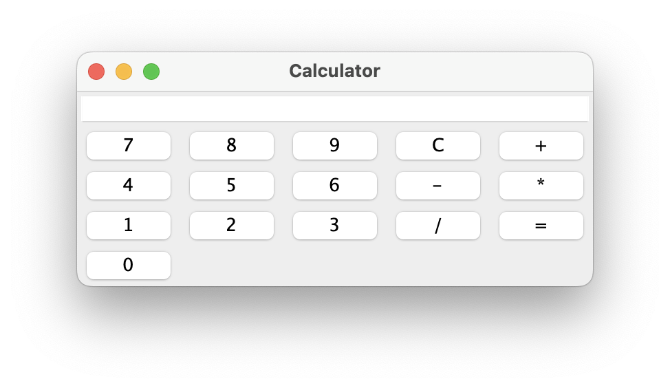

# Calculator Desktop App

## Description

This is a simple calculator desktop app made with Java and Swing.

## Features

- Addition
- Subtraction
- Multiplication
- Division
- Equals
- Clear
  
## Screenshots

## Skills developed in this project

- Java
- Model-View-Controller (MVC) design pattern
- Swing
- Git and GitHub
